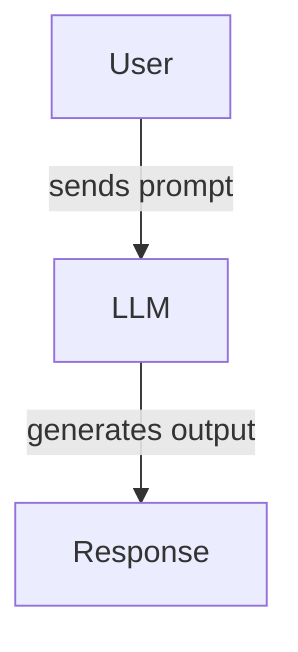

Welcome to the **LLM Attacks Catalog**. This site presents a curated list of known
and emerging attacks on large language models. Browse the sections using the
navigation sidebar or search box.

The source files for this site live in the [`docs/`](../docs) directory.

The above diagram shows a simplified LLM interaction flow.
